##### These procedure steps will be followed on the simulator

1. Click on the simulation button and this page will be displayed. Hover over the description button to get a brief explanation about the experiment.  
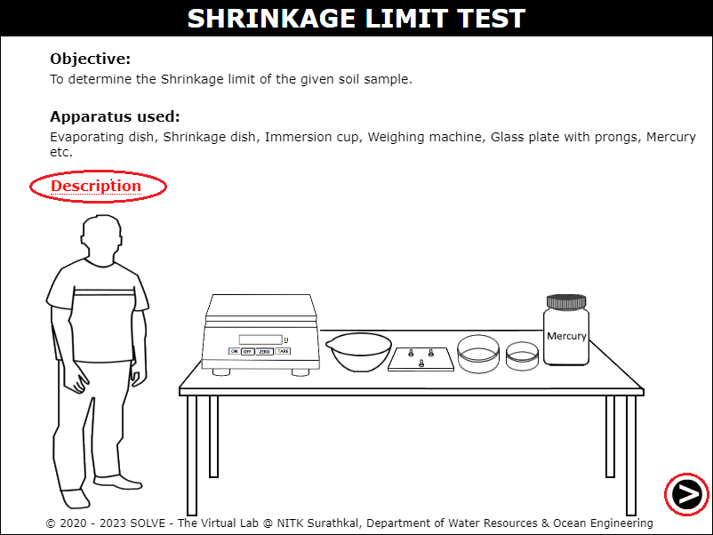 

2. Click on the marked places to sieve the soil sample with a 425 micron sieve and then click on the next button. 
  
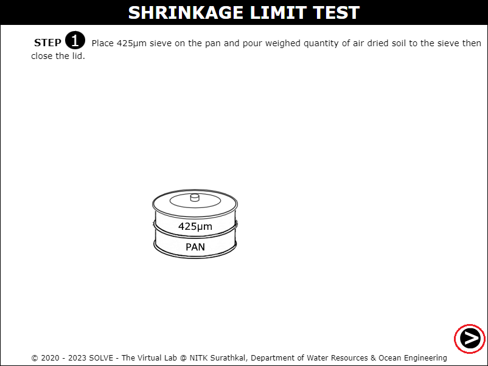 

3. Click on the sieve set to place it inside the sieve shaker and stop the sieve shaker once the task is completed. 
  
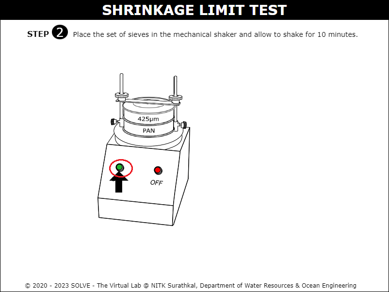  
 

4. Answer the formative question in order to move forward in the simulation. 
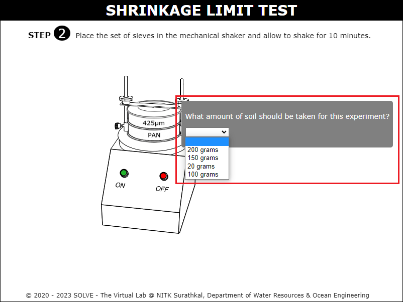 

5. Click on the marked area to remove the soil sample passing through 425 micron sieve and measure 100 grams of the soil sample. 
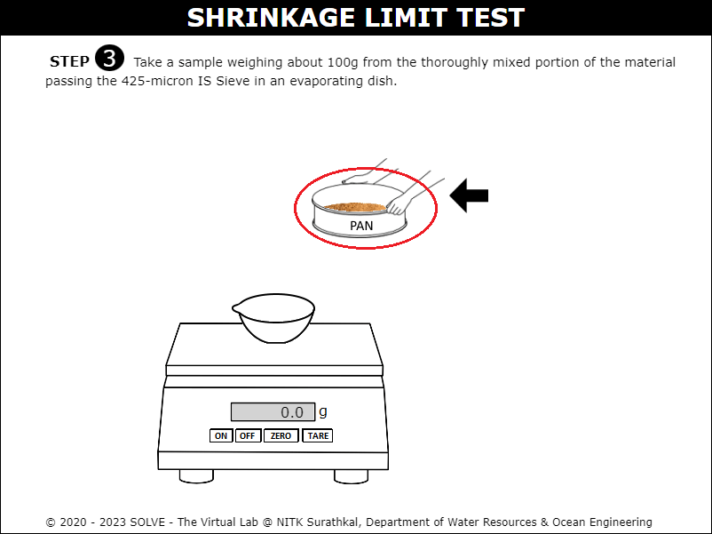 

6. Click on the beaker to pour the water into the cup and click on the trowel to mix the soil and water and click on the next button. 
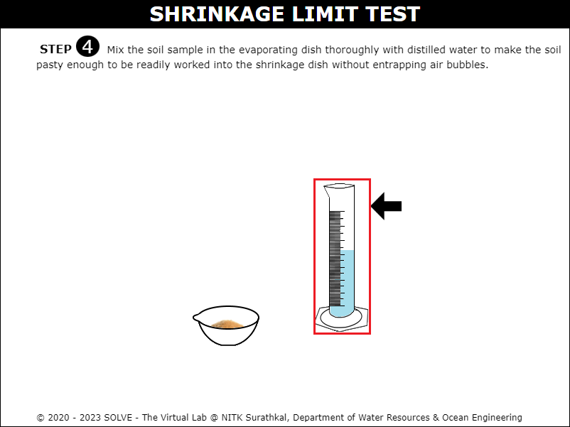  
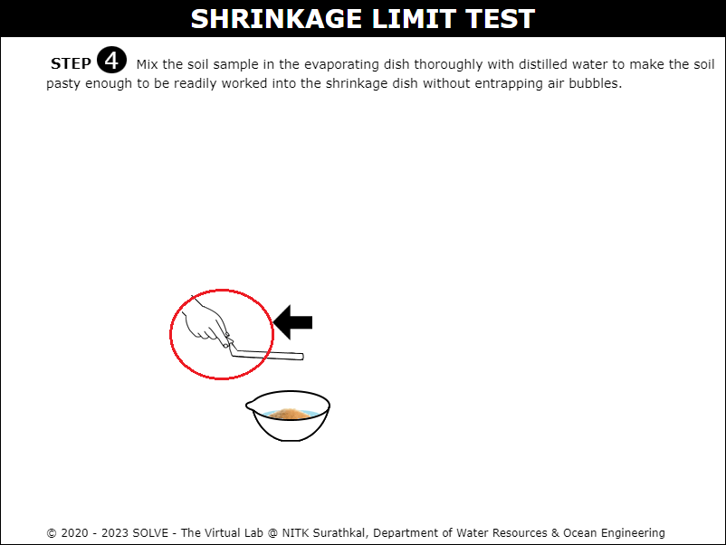 

7. Click on the shrinkage dish and measure its empty weight, and click on the next button. 
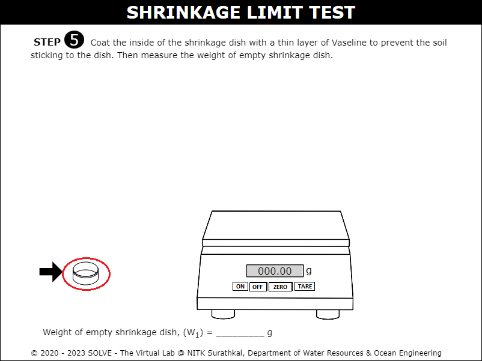 

8. Click on the trowel and fill it inside the shrinkage cup and then click on the next button. 
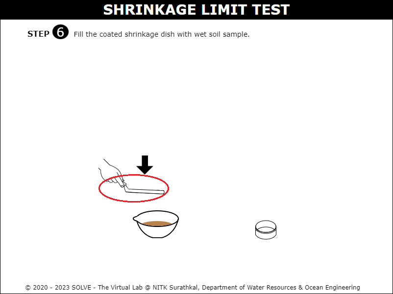 

9. Click on the shrinkage cup with the soil and measure the weight of the sample and click on the next button. 
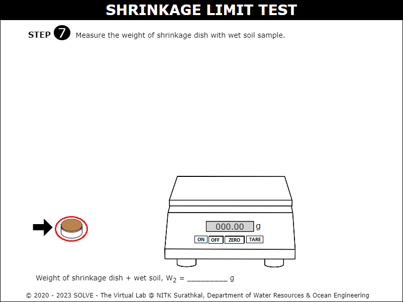 

10. Click on the shrinkage cup and place it inside the oven for 24 hours and then take out the sample after 24 hours and click on the next button. 
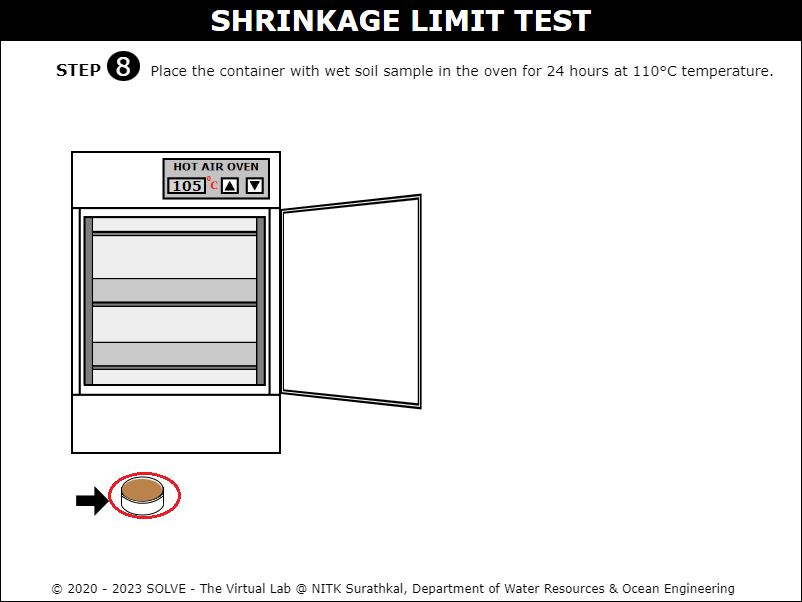  
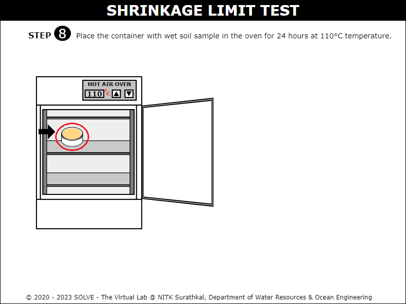 

11. Click on the dried soil pat with the shrinkage cup and measure its weight and click on the next button. 
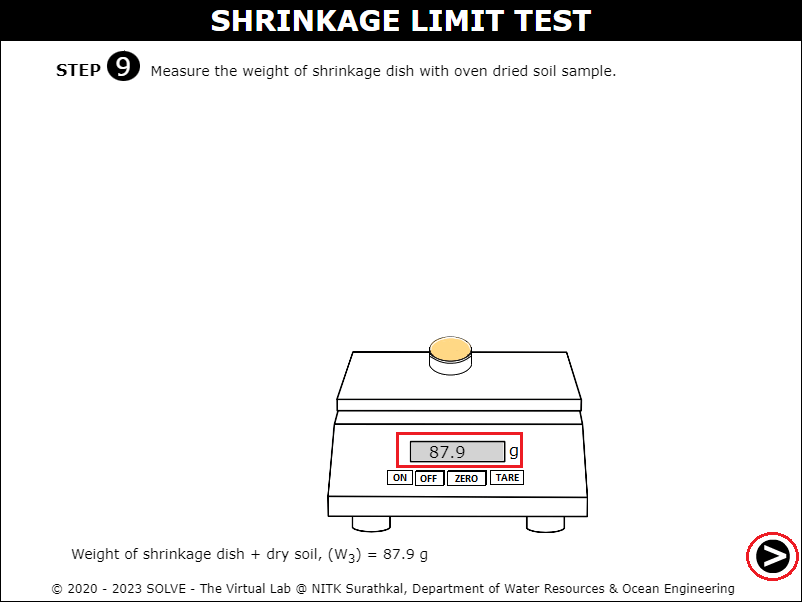 

12. Click on the dried soil pat with the shrinkage cup and measure its weight and click on the next button. 
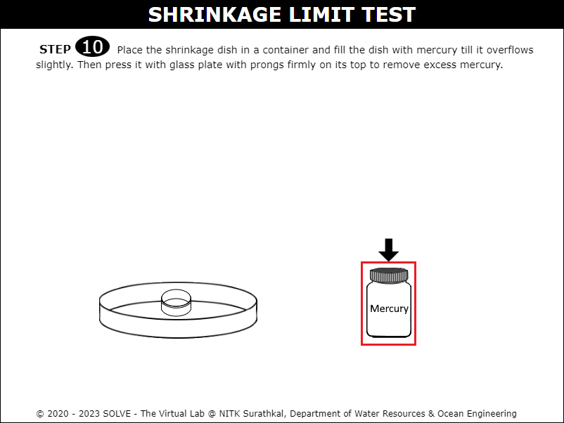  
 

13. Measure the weight of mercury with the shrinkage cup and then click on the next button. 
 

14. Click on the immersion cup and measure its weight and click on the next button. 
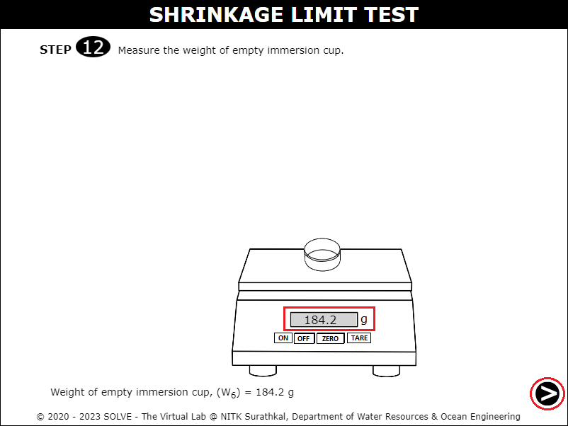 

15. Click on the mercury and pour it inside the immersion cup. Click on the glass plate to remove any excess amount of mercury and then click on the next button. 
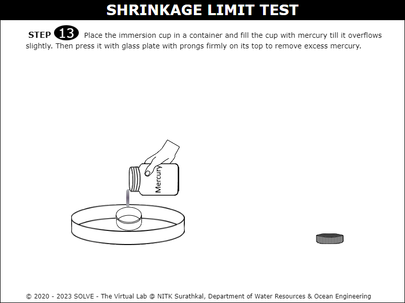  
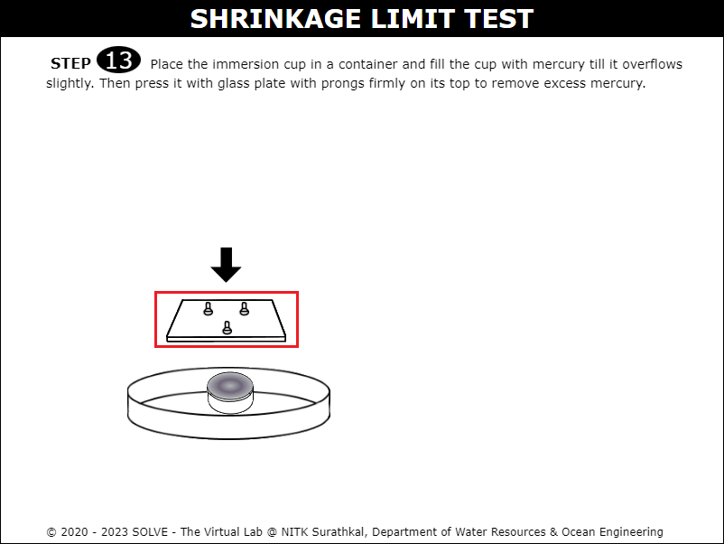 

16. Click on the mercury filled immersion cup and measure its weight and click on the next button. 
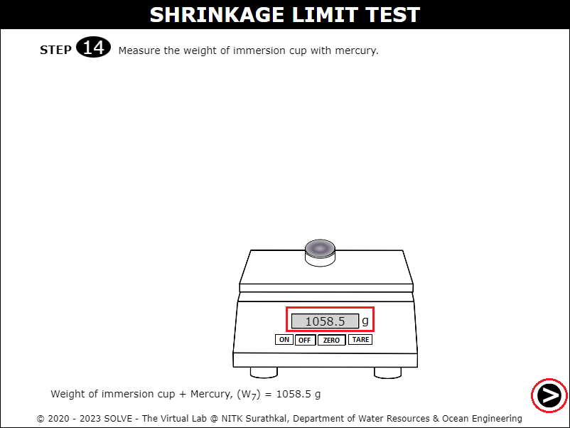 

17. Click on the dry soil pat to place it inside the immersion cup and click on the glass plate to remove any excess mercury. 
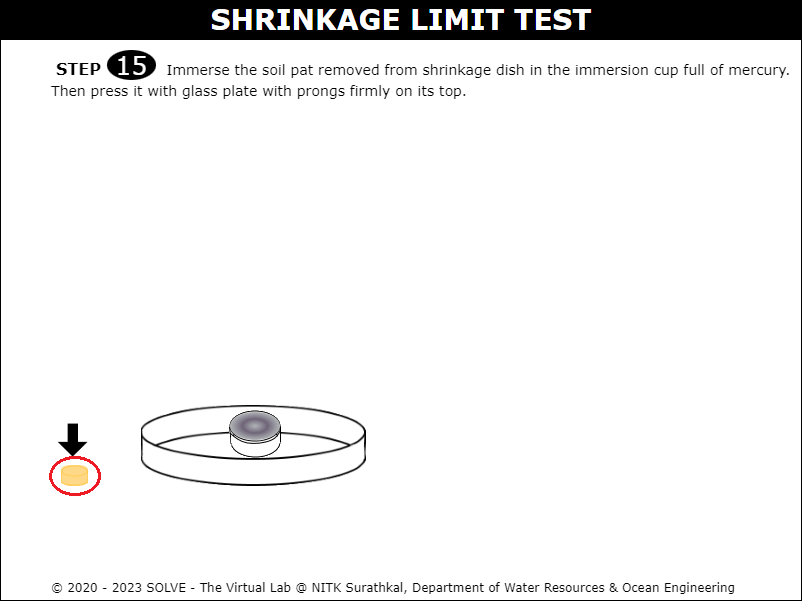  
 

18. Click on the soil pat to remove it from the immersion cup and then measure the weight of remaining mercury in the immersion cup and click on the next button. 
  
 

19. Calculate all the variables and determine the shrinkage limit of the given soil sample based on the collected data.
 
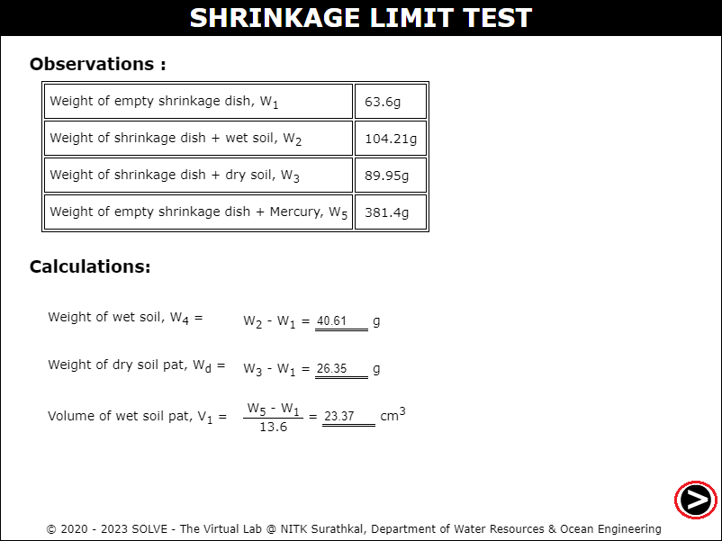  
 
