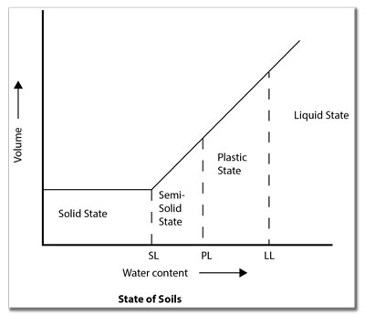
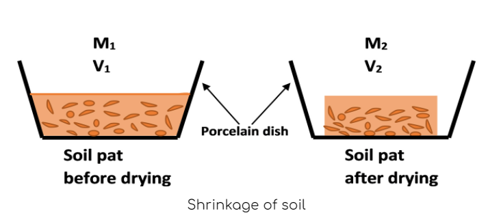

### INTRODUCTION

### Atterberg limits :
The Atterberg limit is the measure of the critical water content of any fine-grained soil. 
Mainly there are three Atterberg limits namely:
<ul>
<li>Liquid limit</li>
<li>Plastic limit</li>
<li>Shrinkage limit</li>
</ul>

These limits help us to differentiate between the 4 states of soil i.e. solid, semi-solid, plastic and liquid and their behaviour in each of these states are different and are explained through these limits. The Atterberg limits are mainly used to distinguish between different types of silt and clay. The water content at which the soil changes from one state to another state is known as the <strong>Atterberg limit or consistency limit</strong>.

 

Graph depicting Atterberg limits

(Source: <a href=" https://www.globalgilson.com/Content/Images/uploaded/blog/soils/state-of-soils-graph.jpg"> https://www.globalgilson.com/Content/Images/uploaded/blog/soils/state-of-soils-graph.jpg</a>)

#### Liquid limit :

Liquid limit (Wl) is defined as the water content corresponding to the arbitrary limit between liquid and plastic states of consistency of soil. It is the maximum water content at which the soil is still in the liquid state but has a small shearing strength against flow.

#### Plastic limit :

Plastic limit (Wp) is the water content corresponding to an arbitrary limit between the plastic and semi-solid states of consistency of soil. It is the minimum water content at which a soil will just begin to crumble when rolled into a thread approximately 3 mm in diameter.

#### Shrinkage limit :

Shrinkage limit (Ws) is defined as the maximum water content at which a reduction in water content will not cause a reduction in volume of a soil mass.
It is the lowest water content at which a soil can still be completely saturated

 

Shrinkage of soil

(Source: <a href=" https://www.geoengineer.org//storage/education/2292/editor_photos/7767/shrinkage-limit.jpg"> https://www.geoengineer.org//storage/education/2292/editor_photos/7767/shrinkage-limit.jpg</a>)

#### Need of Shrinkage Limit test :

By conducting this test on the soil sample we will get a quantitative indication on how the volume of the soil changes with respect to the change in moisture content of the soil.

#### Scope :
* For studying the properties of expansive or cohesive soils Shrinkage.
* Shrinkage factor helps in the design problems of structures built upon these kinds of soils.
* This is very useful in studying the volume changes of soil through the wet and dry seasons.

<strong>The following formula is used to calculate the Shrinkage limit :</strong>

  

Where, 
Wd - W4	= weight of water in the original soil sample of volume V1 
V1		= saturated volume of soil sample 
V2		= dry volume of soil sample 
&gamma;w		= unit weight of water 
Wd		= weight of dry soil

<strong>IS code references :</strong> 
IS: 2720 - 1972 (part IV) : Determination of shrinkage factors.
